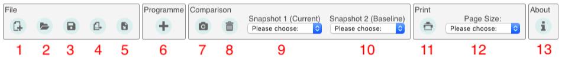
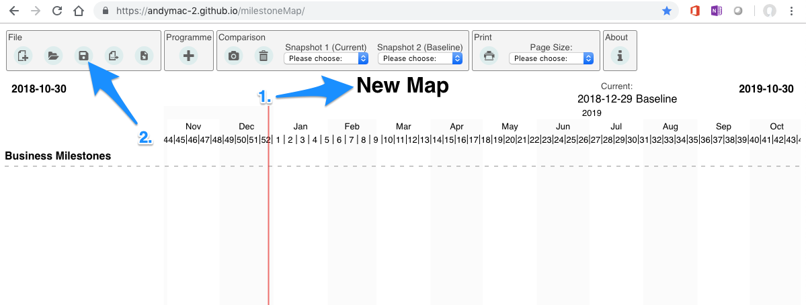
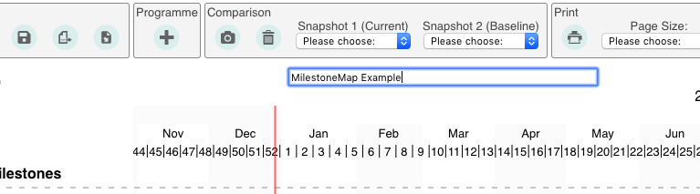
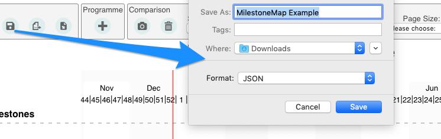
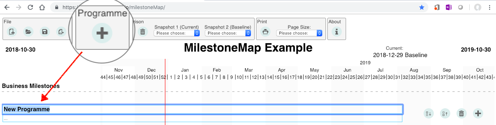

# Overview
## What problem are we were trying to solve?
For a Programme Manager working in the IT delivery space what we want to monitor (and communicate consitently) at the high level is:
1. What the projects and programmes are delivering and when (Milestones)?
2. How confident are we that we will meet that delivery (Health)?
3. Is the delivery reliant on anything else (Dependency)?
4. What has changed (Compare)?

What we don't want to do is constantly have to draw up slides to reflect this to our stakeholders.

milestoneMap was developed to capture and report on this information and do comparisons between the status at 2 different dates.

# User Guide
## Set Up
milestoneMap can be installed locally or run from GitHub (recommended).

To run from GitHub use the following URL [https://andymac-2.github.io/milestoneMap/](https://andymac-2.github.io/milestoneMap/)

## Basics
### Basic screen controls
At the top of the screen are the controls for file management, snapshot management and printing.



**File Controls**
Lets you manage the file the data for milestone map is contained in.

1. Create new map. Creates a *.JSON file.
2. Open existing map.
3. Save open file.
4. Export base data to *.csv file
5. Import data from a *.csv file.

**Programme Control**
6. Create a programme heading.

**Comparison Controls**
Comparisons allow you to show the differences (and movements) of milestones between 2 point sin time (snapshots). E.g.compare "last month" to "now" or compare "last month" to "6 months ago".

7. Take a snapshot of the current status.
8. Delete a snapshot.
9. Current snapshot selection (defaults to the current view).
10. Baseline snapshot. The snapshot you want to compare to.

**Print Controls**
Print the map. There are various pre-defined layouts.

11. Print the milestone map
12. Pre-defined outputs for the milestone map

**About**
13. Version details, help and logging issues for defects or enhancements.


### Creating a milestoneMap
Creating a milestone Map is as simple as saving the file. 



1. Change the title by selecting the "New Map" text at the top of the page. This will be the name of the .JSON file that is created when you select the "Save" option.



2. Select "Save".



*Note! Depending on your browser settings you may have different ways presented to you to save the JSON file. Consider if you want to save copies as you progress or maintain a single file that you overwrite each time.*

	e.g. Chrome has settings to prompt for the overwriting or not.

### Create/Update a Programme
The concept of "programme" in MilestoneMap is merely a collection of projects. It does not need to reflect an actual programme. It can reflect parts of a programme. The primary advantage is that the contents of the "programme" can me moved up and down as a group (see "Moving projects and programmes"

To create a programme:

1. Select the "+" icon which will append a programme group to the canvas.



2. Enter a name for the programme grouping.


### Create/Update a Project
### Create/Update a Milestone
### Create a Dependency
### Printing
### Change the date span
### Moving projects and programmes.

## Beyond Basics
### Import and Export Data
### Working with a Team
### Snapshots and Comparisons

# Troubleshooting
## Known issues
## Requesting Support

# help file

1. this is a list
2. this is the second item

## subheading

add headers to make smaller headings.

How to make *italics* and **bold** text

How to write [links](google.com)

```
this is how you write preformetted text
great for code
hello
```


